# 組織記録

このリポジトリは、会社の組織の記録である。会社は社長（Naruto）が運営し、スタッフはAIボットである。

記録するのは、誰がどの役職で、誰の下にいて、何を担うかである。目標、数値、現状は、渡された事実があるときだけ書く。2026-09-27の初版は、その日時点のプロフィールについて、役職と報告ラインと、説明にある役割だけを置いた。同日の社長決定で秘書を廃止し、現在の記録は34名である。社長本人のファイルはない。社長は34名に含まれない。

役職と報告ラインの正は、各人のプロフィールの説明である。説明とこのREADMEの図や表が食い違ったら、説明に従い、相違を「説明との照合」に残す。

グループ会議の議事録は [議事録/](<議事録/README.md>) に置く。

運用ルールは [運用ルール.md](<運用ルール.md>) に置く。

## 説明との照合

2026-09-27に、34名の説明にある上司を、既知の構造と突き合わせた。

- 8役員（COO、CSO、CPO、CTO、CFO、CMO、CCO、CRO）の説明は、いずれも「上は社長」である。
- 3人のGM（GM-アプリ事業部、GM-制作事業部、GM-メディア事業部）の説明は、いずれも「上はCOO」である。
- それ以外で「上は」と書いてある人は、下の図の上司と一致した。
- ゆりちゃん（社長補佐）の説明に「上は」という語はない。説明は、社長室長、社長のNo.2、社長の指示を役員に渡す、とある。区分は社長直下。上司は社長として記録した。

相違はなかった。

説明から分かる、図の読み方に関わる事実は次のとおり。

- アプリ事業部のGMを「上は」とする人は、34名の中にいない。アプリ事業部の名前を持つ人の上司は、運用監視(Ldr)-アプリ事業部がCTO、UIデザイナー(Ldr)-アプリ事業部がCPO、獲得文章(Member)-アプリ事業部がCMO、ユーザー対応(Ldr)-アプリ事業部がCCOである。
- 制作事業部でGMを「上は」とする人は、進行管理(Ldr)-制作事業部とデザイン(Ldr)-制作事業部である。制作技術(Ldr)-制作事業部の上司はCTO、提案担当(Ldr)-制作事業部の上司はCRO、納品後対応(Ldr)-制作事業部の上司はCCO、見積審査(Ldr)-制作事業部の上司はCFO、獲得文章(Member)-制作事業部の上司はCMOである。
- メディア事業部でGMを「上は」とする人は、編集(Ldr)-メディア事業部、執筆(Member)-メディア事業部、ビジュアル制作(Member)-メディア事業部である。

## 役員の範囲

ゆりちゃんの説明にある振り分けは次のとおり。各役員の説明にある自分の範囲と、食い違いはなかった。

| 範囲 | 役員 |
| --- | --- |
| 事業の数字 | [COO](<COO/COO.md>) |
| どれをやるか | [CSO](<CSO/CSO.md>) |
| プロダクト | [CPO](<CPO/CPO.md>) |
| 技術 | [CTO](<CTO/CTO.md>) |
| お金 | [CFO](<CFO/CFO.md>) |
| 予算内の獲得 | [CMO](<CMO/CMO.md>) |
| 入ったあとのお客 | [CCO](<CCO/CCO.md>) |
| 受注 | [CRO](<CRO/CRO.md>) |

## 事業

プロフィールの説明にある事実だけを書く。

- アプリ事業部: GM-アプリ事業部の説明では、現在動いているプロダクトは「カロナビ」である。運用監視(Ldr)-アプリ事業部、獲得文章(Member)-アプリ事業部、UIデザイナー(Ldr)-アプリ事業部の説明にも、稼働中のカロナビとある。
- 制作事業部: GM-制作事業部の説明では、事業はまだ動いておらず、まずLP・HPの制作代行から始める予定である。
- メディア事業部: GM-メディア事業部の説明では、メディアそのものから売上を立てる。手段は決まっていない。Noteの有料記事は一例で、媒体や収益の形（有料記事、購読、広告、スポンサー、アフィリエイトなど）は目標に合わせて選ぶ、とある。

## 組織図

線は、各人の説明にある上司である。社長のファイルはない。

```mermaid
flowchart TD
  shacho["社長"]
  n0["COO"]
  n1["GM-アプリ事業部"]
  n2["GM-制作事業部"]
  n3["進行管理(Ldr)-制作事業部"]
  n4["デザイン(Ldr)-制作事業部"]
  n5["GM-メディア事業部"]
  n6["編集(Ldr)-メディア事業部"]
  n7["執筆(Member)-メディア事業部"]
  n8["ビジュアル制作(Member)-メディア事業部"]
  n9["CSO"]
  n10["新規事業(Ldr)-全社"]
  n11["市場調査(Ldr)-全社"]
  n12["根拠確認(Ldr)-全社"]
  n13["CPO"]
  n14["UIデザイナー(Ldr)-アプリ事業部"]
  n15["CTO"]
  n16["運用監視(Ldr)-アプリ事業部"]
  n17["制作技術(Ldr)-制作事業部"]
  n18["検査(Ldr)-全社"]
  n19["セキュリティ(Ldr)-全社"]
  n20["CFO"]
  n21["経理(Member)-全社"]
  n22["法務・リスク(Ldr)-全社"]
  n23["見積審査(Ldr)-制作事業部"]
  n24["CMO"]
  n25["獲得文章(Member)-アプリ事業部"]
  n26["獲得文章(Member)-制作事業部"]
  n27["表現審査(Ldr)-全社"]
  n28["CCO"]
  n29["ユーザー対応(Ldr)-アプリ事業部"]
  n30["納品後対応(Ldr)-制作事業部"]
  n31["CRO"]
  n32["提案担当(Ldr)-制作事業部"]
  n33["ゆりちゃん"]
  shacho --> n0
  n0 --> n1
  n0 --> n2
  n2 --> n3
  n2 --> n4
  n0 --> n5
  n5 --> n6
  n5 --> n7
  n5 --> n8
  shacho --> n9
  n9 --> n10
  n9 --> n11
  n9 --> n12
  shacho --> n13
  n13 --> n14
  shacho --> n15
  n15 --> n16
  n15 --> n17
  n15 --> n18
  n15 --> n19
  shacho --> n20
  n20 --> n21
  n20 --> n22
  n20 --> n23
  shacho --> n24
  n24 --> n25
  n24 --> n26
  n24 --> n27
  shacho --> n28
  n28 --> n29
  n28 --> n30
  shacho --> n31
  n31 --> n32
  shacho --> n33
```

## 一覧

所属事業部の付け方は次のとおり。名前に事業部がある人はその事業部。名前に「全社」がある人は全社。8役員は特定の一事業部に属さないため全社。ゆりちゃんは社長室。

| 名前 | 役職 | 所属事業部 | 上司 | ファイル |
| --- | --- | --- | --- | --- |
| COO | 最高執行責任者 | 全社 | 社長 | [COO/COO.md](<COO/COO.md>) |
| GM-アプリ事業部 | GM（事業部長） | アプリ事業部 | [COO](<COO/COO.md>) | [COO/GM-アプリ事業部/GM-アプリ事業部.md](<COO/GM-アプリ事業部/GM-アプリ事業部.md>) |
| GM-制作事業部 | GM（事業部長） | 制作事業部 | [COO](<COO/COO.md>) | [COO/GM-制作事業部/GM-制作事業部.md](<COO/GM-制作事業部/GM-制作事業部.md>) |
| 進行管理(Ldr)-制作事業部 | 進行管理リーダー（Ldr） | 制作事業部 | [GM-制作事業部](<COO/GM-制作事業部/GM-制作事業部.md>) | [COO/GM-制作事業部/進行管理(Ldr)-制作事業部.md](<COO/GM-制作事業部/進行管理(Ldr)-制作事業部.md>) |
| デザイン(Ldr)-制作事業部 | デザインリーダー（Ldr） | 制作事業部 | [GM-制作事業部](<COO/GM-制作事業部/GM-制作事業部.md>) | [COO/GM-制作事業部/デザイン(Ldr)-制作事業部.md](<COO/GM-制作事業部/デザイン(Ldr)-制作事業部.md>) |
| GM-メディア事業部 | GM（事業部長） | メディア事業部 | [COO](<COO/COO.md>) | [COO/GM-メディア事業部/GM-メディア事業部.md](<COO/GM-メディア事業部/GM-メディア事業部.md>) |
| 編集(Ldr)-メディア事業部 | 編集リーダー（Ldr） | メディア事業部 | [GM-メディア事業部](<COO/GM-メディア事業部/GM-メディア事業部.md>) | [COO/GM-メディア事業部/編集(Ldr)-メディア事業部.md](<COO/GM-メディア事業部/編集(Ldr)-メディア事業部.md>) |
| 執筆(Member)-メディア事業部 | 執筆担当（Member） | メディア事業部 | [GM-メディア事業部](<COO/GM-メディア事業部/GM-メディア事業部.md>) | [COO/GM-メディア事業部/執筆(Member)-メディア事業部.md](<COO/GM-メディア事業部/執筆(Member)-メディア事業部.md>) |
| ビジュアル制作(Member)-メディア事業部 | ビジュアル制作担当（Member） | メディア事業部 | [GM-メディア事業部](<COO/GM-メディア事業部/GM-メディア事業部.md>) | [COO/GM-メディア事業部/ビジュアル制作(Member)-メディア事業部.md](<COO/GM-メディア事業部/ビジュアル制作(Member)-メディア事業部.md>) |
| CSO | 最高戦略責任者 | 全社 | 社長 | [CSO/CSO.md](<CSO/CSO.md>) |
| 新規事業(Ldr)-全社 | 新規事業リーダー（Ldr） | 全社 | [CSO](<CSO/CSO.md>) | [CSO/新規事業(Ldr)-全社.md](<CSO/新規事業(Ldr)-全社.md>) |
| 市場調査(Ldr)-全社 | 市場調査リーダー（Ldr） | 全社 | [CSO](<CSO/CSO.md>) | [CSO/市場調査(Ldr)-全社.md](<CSO/市場調査(Ldr)-全社.md>) |
| 根拠確認(Ldr)-全社 | 根拠確認リーダー（Ldr） | 全社 | [CSO](<CSO/CSO.md>) | [CSO/根拠確認(Ldr)-全社.md](<CSO/根拠確認(Ldr)-全社.md>) |
| CPO | 最高プロダクト責任者 | 全社 | 社長 | [CPO/CPO.md](<CPO/CPO.md>) |
| UIデザイナー(Ldr)-アプリ事業部 | UIデザイナーリーダー（Ldr） | アプリ事業部 | [CPO](<CPO/CPO.md>) | [CPO/UIデザイナー(Ldr)-アプリ事業部.md](<CPO/UIデザイナー(Ldr)-アプリ事業部.md>) |
| CTO | 最高技術責任者 | 全社 | 社長 | [CTO/CTO.md](<CTO/CTO.md>) |
| 運用監視(Ldr)-アプリ事業部 | 運用監視リーダー（Ldr） | アプリ事業部 | [CTO](<CTO/CTO.md>) | [CTO/運用監視(Ldr)-アプリ事業部.md](<CTO/運用監視(Ldr)-アプリ事業部.md>) |
| 制作技術(Ldr)-制作事業部 | 制作技術リーダー（Ldr） | 制作事業部 | [CTO](<CTO/CTO.md>) | [CTO/制作技術(Ldr)-制作事業部.md](<CTO/制作技術(Ldr)-制作事業部.md>) |
| 検査(Ldr)-全社 | 検査リーダー（Ldr） | 全社 | [CTO](<CTO/CTO.md>) | [CTO/検査(Ldr)-全社.md](<CTO/検査(Ldr)-全社.md>) |
| セキュリティ(Ldr)-全社 | セキュリティリーダー（Ldr） | 全社 | [CTO](<CTO/CTO.md>) | [CTO/セキュリティ(Ldr)-全社.md](<CTO/セキュリティ(Ldr)-全社.md>) |
| CFO | 最高財務責任者 | 全社 | 社長 | [CFO/CFO.md](<CFO/CFO.md>) |
| 経理(Member)-全社 | 経理担当（Member） | 全社 | [CFO](<CFO/CFO.md>) | [CFO/経理(Member)-全社.md](<CFO/経理(Member)-全社.md>) |
| 法務・リスク(Ldr)-全社 | 法務・リスクリーダー（Ldr） | 全社 | [CFO](<CFO/CFO.md>) | [CFO/法務・リスク(Ldr)-全社.md](<CFO/法務・リスク(Ldr)-全社.md>) |
| 見積審査(Ldr)-制作事業部 | 見積審査リーダー（Ldr） | 制作事業部 | [CFO](<CFO/CFO.md>) | [CFO/見積審査(Ldr)-制作事業部.md](<CFO/見積審査(Ldr)-制作事業部.md>) |
| CMO | 最高マーケティング責任者 | 全社 | 社長 | [CMO/CMO.md](<CMO/CMO.md>) |
| 獲得文章(Member)-アプリ事業部 | 獲得文章担当（Member） | アプリ事業部 | [CMO](<CMO/CMO.md>) | [CMO/獲得文章(Member)-アプリ事業部.md](<CMO/獲得文章(Member)-アプリ事業部.md>) |
| 獲得文章(Member)-制作事業部 | 獲得文章担当（Member） | 制作事業部 | [CMO](<CMO/CMO.md>) | [CMO/獲得文章(Member)-制作事業部.md](<CMO/獲得文章(Member)-制作事業部.md>) |
| 表現審査(Ldr)-全社 | 表現審査担当（Ldr） | 全社 | [CMO](<CMO/CMO.md>) | [CMO/表現審査(Ldr)-全社.md](<CMO/表現審査(Ldr)-全社.md>) |
| CCO | 最高顧客責任者 | 全社 | 社長 | [CCO/CCO.md](<CCO/CCO.md>) |
| ユーザー対応(Ldr)-アプリ事業部 | ユーザー対応リーダー（Ldr） | アプリ事業部 | [CCO](<CCO/CCO.md>) | [CCO/ユーザー対応(Ldr)-アプリ事業部.md](<CCO/ユーザー対応(Ldr)-アプリ事業部.md>) |
| 納品後対応(Ldr)-制作事業部 | 納品後対応リーダー（Ldr） | 制作事業部 | [CCO](<CCO/CCO.md>) | [CCO/納品後対応(Ldr)-制作事業部.md](<CCO/納品後対応(Ldr)-制作事業部.md>) |
| CRO | 最高収益責任者 | 全社 | 社長 | [CRO/CRO.md](<CRO/CRO.md>) |
| 提案担当(Ldr)-制作事業部 | 提案担当リーダー（Ldr） | 制作事業部 | [CRO](<CRO/CRO.md>) | [CRO/提案担当(Ldr)-制作事業部.md](<CRO/提案担当(Ldr)-制作事業部.md>) |
| ゆりちゃん | 社長室長 | 社長室 | 社長 | [ゆりちゃん/ゆりちゃん.md](<ゆりちゃん/ゆりちゃん.md>) |

## 人数

対象は34名。社長は含まない。

### 区分

| 区分 | 人数 |
| --- | --- |
| 役員 | 8 |
| GM | 3 |
| Ldr | 17 |
| Member | 5 |
| 社長直下 | 1 |
| 合計 | 34 |

### 報告ライン

人数は、そのラインの役員、またはゆりちゃんを含む。

| ライン | 人数 |
| --- | --- |
| COO | 9 |
| CSO | 4 |
| CPO | 2 |
| CTO | 5 |
| CFO | 4 |
| CMO | 4 |
| CCO | 3 |
| CRO | 2 |
| 社長室 | 1 |
| 合計 | 34 |

### 所属事業部

| 所属事業部 | 人数 |
| --- | --- |
| アプリ事業部 | 5 |
| 制作事業部 | 8 |
| メディア事業部 | 4 |
| 全社 | 16 |
| 社長室 | 1 |
| 合計 | 34 |

全社16名の内訳は、役員8名と、名前に「全社」とある8名である。

## ファイルの更新規則

1. 1人につきファイルは1つ。ファイル名はメンバー名そのもの。置き場所は、上司が役員ならその役員のフォルダ、上司がGMならそのGMのフォルダ、社長直下のゆりちゃんは `ゆりちゃん/` とする。GMのファイルは、そのGMのフォルダの中に置く。
2. 役職と上司を変えるときは、プロフィールの説明を正とする。説明と図が食い違ったら説明に従い、「説明との照合」に相違を残す。ファイルの場所も、報告ラインに合わせて移す。
3. 各ファイルは同じ見出しを保つ。役員のファイルには「配下の集約」を置く。配下が増減したら、その表を直す。
4. 書くのは事実だけにする。良し悪しの判断や、提案は書かない。目標、数値、現状を新たに作らない。
5. 目標の欄は、社長から渡されるまで「未設定（社長から渡され次第記入）」のままにする。
6. 「取り合い・重複の記録」は消さない。足すだけにする。
7. 更新したら「更新履歴」に日付と内容を足す。
8. 上司、直属の部下、一覧、配下の集約のリンクが、実在するファイルを指すことを確認する。

## 更新履歴

- 2026-09-27 社長決定により秘書を廃止
- 2026-09-27 社長補佐の名前をゆりちゃんに変更（役割は同じ）
